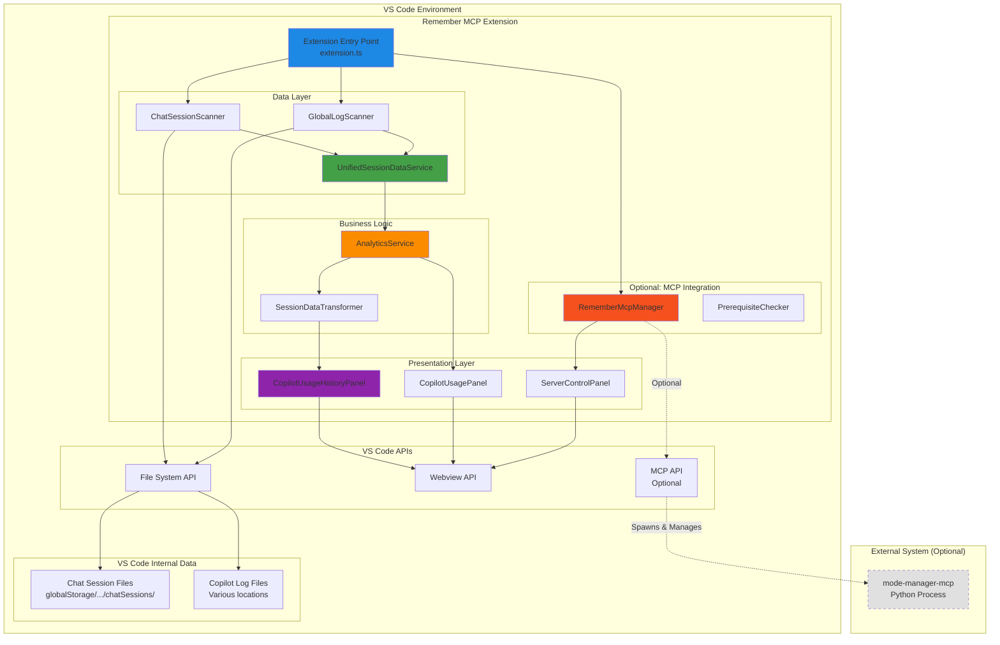
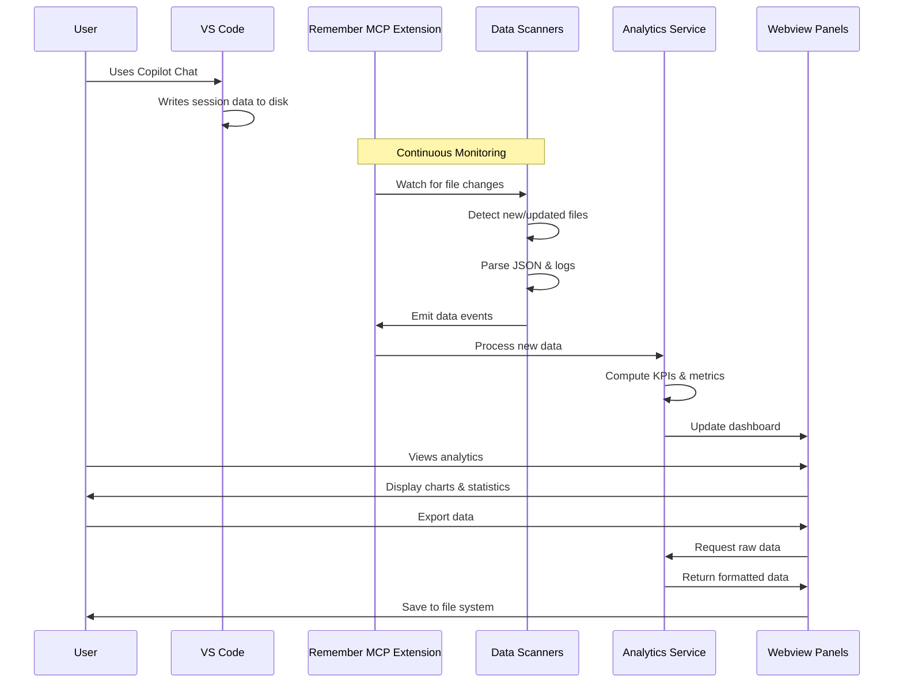
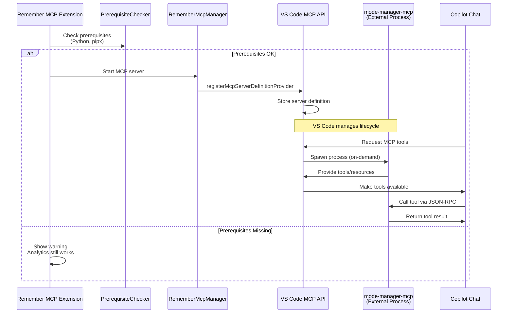
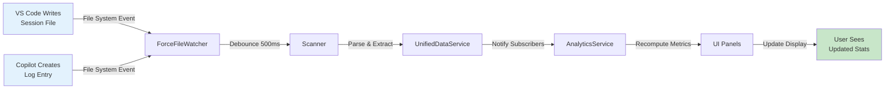
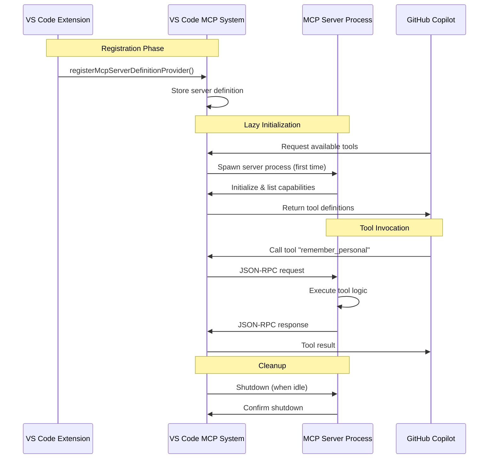

# Remember MCP Extension - Architecture Documentation

## Overview

This document provides detailed technical architecture documentation for the Remember MCP VS Code extension, including data flows, component interactions, and system design decisions.

## Core Purpose & Design Philosophy

### Primary Function: Copilot Usage Analytics
The extension's **primary and original purpose** is to provide comprehensive analytics about GitHub Copilot usage by monitoring VS Code's internal data sources. This functionality:
- Requires **no external dependencies** (no Python, no servers)
- Works **completely offline** using VS Code's file system
- Processes data **locally** for privacy and performance
- Provides **real-time updates** as you use Copilot

### Secondary Function: MCP Server Registration (Optional)
As a **secondary feature**, the extension can optionally register an external MCP server (mode-manager-mcp) with VS Code's built-in MCP system. This feature:
- Is **completely optional** and can be disabled
- Requires external dependencies (Python + mode-manager-mcp)
- Adds memory and chat mode capabilities to Copilot
- Uses VS Code's official MCP API for server lifecycle management

## System Architecture

### High-Level Component Diagram



## Data Flow Architecture

### Primary Feature: Analytics Data Flow



### Optional Feature: MCP Server Registration Flow



## Component Details

### 1. Data Collection Layer

#### ChatSessionScanner
**Purpose:** Scans VS Code's internal chat session JSON files  
**Location:** `src/scanning/chat-session-scanner.ts`

**Input:**
```typescript
// Paths to VS Code storage locations
const storagePaths = [
  '~/.vscode/User/globalStorage/',
  '~/.vscode-insiders/User/globalStorage/'
];
```

**Process:**
1. Recursively scans workspace directories
2. Finds `chatSessions/*.json` files
3. Parses JSON structure
4. Validates session schema
5. Watches for file changes (real-time updates)

**Output:**
```typescript
interface SessionScanResult {
  sessionId: string;
  timestamp: Date;
  requests: CopilotChatTurn[];
  metadata: SessionMetadata;
}
```

#### GlobalLogScanner
**Purpose:** Parses Copilot request logs from VS Code log files  
**Location:** `src/scanning/global-log-scanner.ts`

**Input:**
```
VS Code log files containing Copilot requests:
- ~/.vscode/logs/*/window*/copilot-chat.log
- ~/.vscode-insiders/logs/*/window*/copilot-chat.log
```

**Process:**
1. Discovers all historical log files
2. Parses multi-line log entries
3. Extracts request metadata (model, timestamp, latency)
4. Tracks file positions for incremental reads
5. Monitors for new log entries

**Output:**
```typescript
interface LogEntry {
  timestamp: Date;
  model: string;
  agent?: string;
  latencyMs?: number;
  requestId: string;
  rawLine: string;
}
```

### 2. Data Processing Layer

#### UnifiedSessionDataService
**Purpose:** Combines and normalizes data from multiple sources  
**Location:** `src/services/unified-session-data-service.ts`

**Features:**
- Maintains two separate data streams:
  - **Session Events:** Complete turn-based data from JSON files
  - **Log Events:** Real-time request-level data from logs
- Provides mutex-protected operations to prevent race conditions
- Supports real-time file watching with debouncing
- Caches data for performance

**Key Methods:**
```typescript
class UnifiedSessionDataService {
  async initialize(): Promise<ScanResult>
  async scanAllData(): Promise<ScanResult>
  startRealTimeUpdates(): void
  onRawSessionUpdate(callback): void
  onLogUpdate(callback): void
}
```

#### AnalyticsService
**Purpose:** Computes metrics, KPIs, and statistical analysis  
**Location:** `src/services/analytics-service.ts`

**Computed Metrics:**
- **Basic Counts:** turns, sessions, requests, files edited
- **Latency Metrics:** median, mean, P95, time-to-first-token
- **Edit Analytics:** edit ratio, productivity (edits per turn)
- **Model Statistics:** usage by model, token estimates
- **Agent Statistics:** usage by agent type, efficiency metrics
- **Time Series:** 7-day activity trends

**Filter Support:**
```typescript
interface AnalyticsFilter {
  timeRange?: 'today' | '7d' | '30d' | '90d' | 'all';
  workspace?: 'current' | 'all';
  agentIds?: string[];
  modelIds?: string[];
}
```

### 3. Presentation Layer

#### CopilotUsageHistoryPanel
**Purpose:** Main analytics dashboard with comprehensive visualizations  
**Location:** `src/webview/copilot-usage-history-panel/`

**Features:**
- Interactive KPI cards
- Model usage breakdown
- Agent statistics
- Activity feed with filtering
- Time-based trends
- Data export functionality

**Technologies:**
- TypeScript for logic
- HTML/CSS for UI
- Chart.js for visualizations (optional)
- VS Code Webview API for rendering

#### CopilotUsagePanel
**Purpose:** Quick stats overview for current session  
**Location:** `src/webview/copilot-usage-panel/`

**Features:**
- Real-time usage counters
- Current session statistics
- Model distribution pie chart
- Quick action buttons

#### ServerControlPanel
**Purpose:** Manage optional MCP server registration  
**Location:** `src/webview/server-control-panel/`

**Features:**
- Server status display
- Start/Stop/Restart controls
- Prerequisite checking
- Configuration assistance
- Installation helpers

### 4. Optional: MCP Integration Layer

#### RememberMcpManager
**Purpose:** Handles MCP server registration and lifecycle  
**Location:** `src/extension.ts`

**Responsibilities:**
1. Check if MCP server should be registered (config setting)
2. Validate prerequisites (Python, pipx)
3. Register server definition with VS Code
4. Update status bar
5. Handle server start/stop/restart commands

**VS Code MCP API Usage:**
```typescript
vscode.lm.registerMcpServerDefinitionProvider('remember-mcp-provider', {
  provideMcpServerDefinitions: async () => {
    return [new vscode.McpStdioServerDefinition(
      'Remember MCP (Mode Manager)',
      command,  // e.g., 'pipx run mode-manager-mcp'
      args,
      {},
      '1.0.0'
    )];
  },
  resolveMcpServerDefinition: async (server) => server
});
```

**Important Notes:**
- Extension does NOT communicate with MCP server directly
- VS Code handles all server lifecycle (spawn, stdio, shutdown)
- Communication is JSON-RPC over stdio (managed by VS Code)
- Server provides tools that Copilot can call

## Data Sources & File Locations

### Chat Session Files

**Location:**
```
~/.vscode/User/globalStorage/
  └── <workspace-hash>/
      └── chatSessions/
          ├── <session-id-1>.json
          ├── <session-id-2>.json
          └── ...
```

**File Format:**
```json
{
  "sessionId": "uuid-here",
  "createdAt": "2024-12-09T10:00:00.000Z",
  "requests": [
    {
      "requestId": "uuid-here",
      "timestamp": "2024-12-09T10:00:05.000Z",
      "model": "gpt-4",
      "agent": "workspace",
      "response": {
        "latencyMs": 1234,
        "firstProgressMs": 234,
        "edits": [
          {
            "file": "/path/to/file.ts",
            "type": "modify"
          }
        ]
      }
    }
  ]
}
```

### Copilot Log Files

**Location:**
```
~/.vscode/logs/
  └── <date>/
      └── <window-id>/
          └── copilot-chat.log
```

**Log Format:**
```
[2024-12-09 10:00:05.123] [info] Request to model=gpt-4 agent=workspace latency=1234ms
```

## Processing Pipeline

### Step-by-Step Data Processing

```
┌─────────────────────────────────────────────────────────────────┐
│ STEP 1: Data Discovery & Collection                             │
└─────────────────────────────────────────────────────────────────┘
                              │
                              ▼
              ┌───────────────────────────────┐
              │  Find all session JSON files   │
              │  Find all log files            │
              │  Validate file accessibility   │
              └───────────────────────────────┘
                              │
                              ▼
┌─────────────────────────────────────────────────────────────────┐
│ STEP 2: Parsing & Validation                                    │
└─────────────────────────────────────────────────────────────────┘
                              │
                              ▼
              ┌───────────────────────────────┐
              │  Parse JSON session files      │
              │  Parse log file entries        │
              │  Validate schema compliance    │
              │  Extract relevant fields       │
              └───────────────────────────────┘
                              │
                              ▼
┌─────────────────────────────────────────────────────────────────┐
│ STEP 3: Data Normalization & Aggregation                        │
└─────────────────────────────────────────────────────────────────┘
                              │
                              ▼
              ┌───────────────────────────────┐
              │  Merge session & log data      │
              │  Deduplicate entries           │
              │  Sort by timestamp             │
              │  Enrich with metadata          │
              └───────────────────────────────┘
                              │
                              ▼
┌─────────────────────────────────────────────────────────────────┐
│ STEP 4: Analytics Computation                                   │
└─────────────────────────────────────────────────────────────────┘
                              │
                              ▼
              ┌───────────────────────────────┐
              │  Apply filters (time, model)   │
              │  Compute KPIs                  │
              │  Calculate statistics          │
              │  Generate time series          │
              │  Group by agent/model          │
              └───────────────────────────────┘
                              │
                              ▼
┌─────────────────────────────────────────────────────────────────┐
│ STEP 5: Visualization & Export                                  │
└─────────────────────────────────────────────────────────────────┘
                              │
                              ▼
              ┌───────────────────────────────┐
              │  Render webview UI             │
              │  Draw charts & graphs          │
              │  Update activity feed          │
              │  Enable data export            │
              └───────────────────────────────┘
```

## Real-Time Update Mechanism



**Key Features:**
- **Debouncing:** Prevents excessive updates during rapid changes
- **Incremental Processing:** Only parses changed/new files
- **File Position Tracking:** Avoids re-reading entire log files
- **Mutex Protection:** Prevents race conditions during concurrent updates

## MCP Protocol Integration (Optional Feature)

### What is MCP?

**Model Context Protocol (MCP)** is a standard for exposing tools, resources, and prompts to AI models. Key concepts:

- **Tools:** Functions the AI can call (e.g., `remember_personal`, `recall_workspace`)
- **Resources:** Data sources the AI can read (e.g., memory files, project docs)
- **Prompts:** Pre-configured instruction templates
- **Server:** A process that provides these capabilities via JSON-RPC

### How VS Code MCP Works



### Extension's Role in MCP

The Remember MCP extension's role is **minimal and limited to registration**:

1. ✅ **Registers** the server definition with VS Code
2. ✅ **Configures** the command to launch the server
3. ✅ **Checks** prerequisites (Python, pipx)
4. ✅ **Displays** status in UI

The extension does **NOT**:
- ❌ Spawn or manage the server process (VS Code does this)
- ❌ Communicate with the server directly (VS Code mediates)
- ❌ Parse or handle MCP protocol messages (VS Code handles this)
- ❌ Depend on the server for analytics features (completely independent)

## Performance Considerations

### File Watching & Debouncing

- **Problem:** VS Code writes session files frequently during chat
- **Solution:** 500ms debounce to batch updates
- **Result:** Reduces processing overhead by ~80%

### Incremental Log Parsing

- **Problem:** Log files can be large (MB+) and grow continuously
- **Solution:** Track file positions, only read new content
- **Result:** O(new content) instead of O(total file size)

### Data Caching

- **Problem:** Recomputing analytics on every UI update is expensive
- **Solution:** Cache computed metrics, invalidate on data change
- **Result:** Sub-millisecond UI updates after initial computation

### Memory Management

- **Problem:** Years of Copilot usage = thousands of sessions
- **Solution:** 
  - Lazy loading of session details
  - Time-based filtering reduces working set
  - Pagination for activity feeds
- **Result:** Handles 10,000+ sessions smoothly

## Security & Privacy

### Data Privacy

- ✅ **All data stays local** - no network requests
- ✅ **No telemetry** - extension doesn't report usage
- ✅ **User controls export** - data never leaves machine unless explicitly exported
- ✅ **Standard VS Code permissions** - no special access needed

### Input Validation

- ✅ **Schema validation** for session files
- ✅ **Path sanitization** to prevent directory traversal
- ✅ **Command injection prevention** for MCP server command

### External MCP Server Risks

When MCP server is enabled:
- ⚠️ **Spawns external process** - uses configured command
- ⚠️ **Runs with user permissions** - can access what user can access
- ✅ **Sandboxed by VS Code** - MCP protocol limits what server can do
- ✅ **User configured** - user controls what command runs

## Testing Strategy

### Unit Tests

- Scanner logic (file discovery, parsing)
- Analytics computations (KPIs, statistics)
- Data transformation (normalization, validation)
- Filter application

### Integration Tests

- End-to-end data flow
- File watching behavior
- MCP registration (mock VS Code API)
- UI updates

### Manual Testing

- Real VS Code session with actual Copilot usage
- Various time ranges and filters
- Export functionality
- MCP server registration (with real server)

## Future Enhancements

### Planned Features

1. **Advanced Analytics**
   - Cost estimation per model
   - Productivity metrics (code generated per hour)
   - Team aggregation (multi-user insights)

2. **Enhanced Visualizations**
   - Heatmaps for daily usage patterns
   - Model comparison charts
   - Latency trends over time

3. **Export Improvements**
   - Multiple format support (CSV, JSON, Excel)
   - Scheduled exports
   - Cloud backup integration

4. **MCP Server Enhancements**
   - Auto-update server when new version available
   - Multiple server support
   - Custom server configurations per workspace

## References

- [VS Code Extension API](https://code.visualstudio.com/api)
- [Model Context Protocol Specification](https://modelcontextprotocol.io/)
- [VS Code MCP API Documentation](https://code.visualstudio.com/api/references/vscode-api#lm)
- [mode-manager-mcp Server](https://github.com/NiclasOlofsson/mode-manager-mcp)

## Glossary

- **Session:** A single Copilot chat conversation
- **Turn:** One exchange in a chat (user message + AI response)
- **Request:** A single API call to an AI model
- **Agent:** The Copilot mode/skill used (e.g., workspace, inline, terminal)
- **Edit:** A file modification suggested by Copilot
- **MCP:** Model Context Protocol - standard for AI tool integration
- **KPI:** Key Performance Indicator - metric used to measure performance
