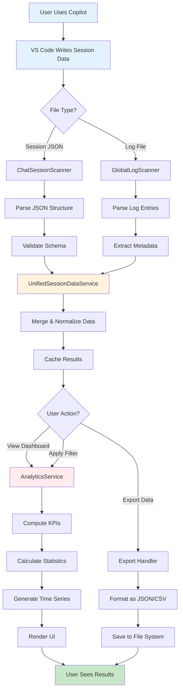
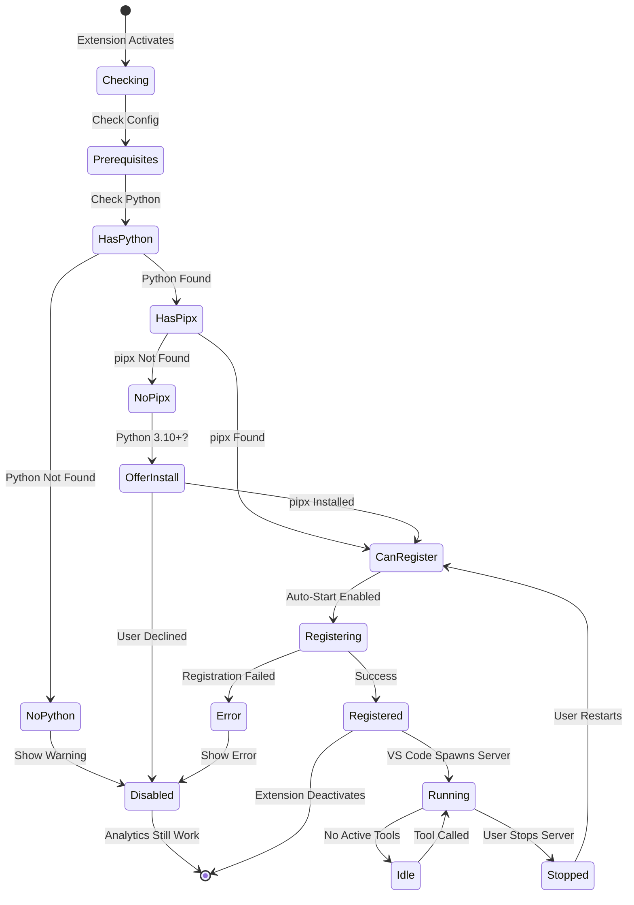
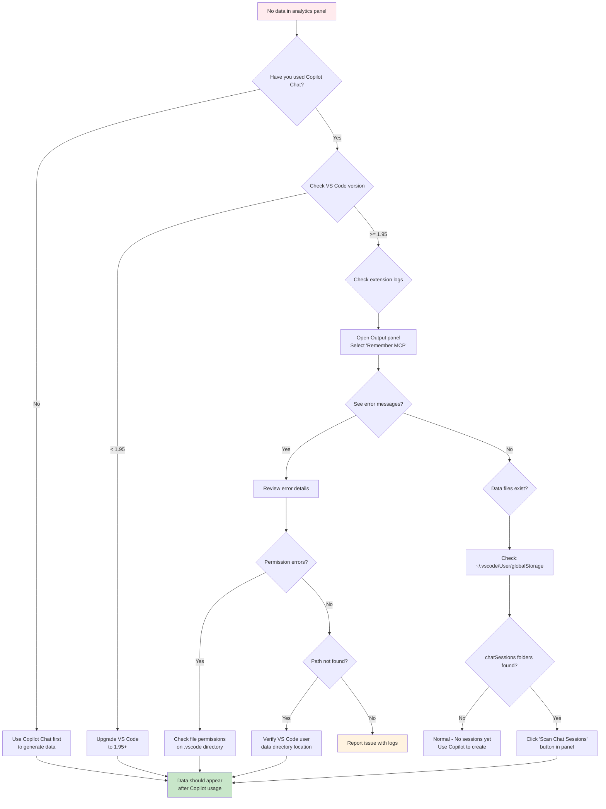

# Remember MCP Extension - Visual Diagrams & Flowcharts

This document provides visual representations of the extension's architecture, data flows, and processes using both Mermaid and ASCII art.

## Table of Contents

- [Extension Input/Output Overview](#extension-inputoutput-overview)
- [Primary Feature: Analytics Pipeline](#primary-feature-analytics-pipeline)
- [Secondary Feature: MCP Server Integration](#secondary-feature-mcp-server-integration)
- [Troubleshooting Flowcharts](#troubleshooting-flowcharts)

---

## Extension Input/Output Overview

### What Goes In, What Comes Out

```
╔═══════════════════════════════════════════════════════════════════════════════╗
║                        REMEMBER MCP EXTENSION                                  ║
╚═══════════════════════════════════════════════════════════════════════════════╝

INPUT                              PROCESSING                           OUTPUT
═════                              ══════════                          ══════

┌─────────────────┐               ┌─────────────────┐                ┌──────────────────┐
│ Chat Session    │──────────────▶│ ChatSession     │──────────────▶│ Usage Analytics  │
│ JSON Files      │               │ Scanner         │                │ Dashboard        │
│                 │               │                 │                │                  │
│ Location:       │               │ • Parses JSON   │                │ • Total requests │
│ ~/.vscode/User/ │               │ • Validates     │                │ • Model breakdown│
│ globalStorage/  │               │ • Extracts      │                │ • Agent stats    │
│ .../chatSessions│               │   metadata      │                │ • Edit tracking  │
└─────────────────┘               └─────────────────┘                │ • Time series    │
                                                                       └──────────────────┘
┌─────────────────┐               ┌─────────────────┐                           │
│ Copilot Log     │──────────────▶│ GlobalLog       │──────────────────────────┤
│ Files           │               │ Scanner         │                           │
│                 │               │                 │                           │
│ Location:       │               │ • Parses logs   │                           │
│ ~/.vscode/logs/ │               │ • Extracts      │                           ▼
│ .../window*/    │               │   requests      │                ┌──────────────────┐
│ copilot-chat.log│               │ • Tracks        │                │ Activity Feed    │
└─────────────────┘               │   positions     │                │                  │
                                  └─────────────────┘                │ • Recent actions │
                                           │                          │ • Model used     │
                                           │                          │ • Files edited   │
                                           ▼                          │ • Timestamps     │
┌─────────────────┐               ┌─────────────────┐                └──────────────────┘
│ VS Code File    │──────────────▶│ Unified         │                           │
│ System Watcher  │               │ SessionData     │                           │
│                 │               │ Service         │                           ▼
│ Detects:        │               │                 │                ┌──────────────────┐
│ • New files     │               │ • Merges data   │                │ Data Export      │
│ • Modified files│               │ • Deduplicates  │                │                  │
│ • Real-time     │               │ • Normalizes    │                │ • JSON format    │
│   updates       │               │ • Caches        │                │ • CSV format     │
└─────────────────┘               └─────────────────┘                │ • Complete data  │
                                           │                          │ • Filtered data  │
                                           ▼                          └──────────────────┘
                                  ┌─────────────────┐
                                  │ Analytics       │
                                  │ Service         │
                                  │                 │
                                  │ • Computes KPIs │
                                  │ • Applies       │
                                  │   filters       │
                                  │ • Calculates    │
                                  │   statistics    │
                                  │ • Generates     │
                                  │   charts data   │
                                  └─────────────────┘
```

---

## Primary Feature: Analytics Pipeline

### End-to-End Data Processing Flow



### Real-Time Update Cycle

```
                    ┌──────────────────────────────────────────┐
                    │  File System Watcher (ForceFileWatcher)  │
                    │  Monitors: Session files & Log files     │
                    └──────────────────────────────────────────┘
                                      │
                    ┌─────────────────▼─────────────────┐
                    │  File Change Detected             │
                    │  (new file, modification, append) │
                    └─────────────────┬─────────────────┘
                                      │
                    ┌─────────────────▼─────────────────┐
                    │  Debounce (500ms)                 │
                    │  Prevents rapid-fire processing   │
                    └─────────────────┬─────────────────┘
                                      │
                    ┌─────────────────▼─────────────────┐
                    │  Scanner Processes File           │
                    │  • Read new/changed content only  │
                    │  • Parse relevant data            │
                    │  • Validate structure             │
                    └─────────────────┬─────────────────┘
                                      │
                    ┌─────────────────▼─────────────────┐
                    │  Unified Service Updates          │
                    │  • Merge with existing data       │
                    │  • Update caches                  │
                    │  • Notify subscribers             │
                    └─────────────────┬─────────────────┘
                                      │
                    ┌─────────────────▼─────────────────┐
                    │  Analytics Service Recomputes     │
                    │  • Invalidate affected metrics    │
                    │  • Recalculate KPIs               │
                    │  • Update time series             │
                    └─────────────────┬─────────────────┘
                                      │
                    ┌─────────────────▼─────────────────┐
                    │  UI Panels Update                 │
                    │  • Refresh displayed data         │
                    │  • Animate changes                │
                    │  • Update charts                  │
                    └─────────────────┬─────────────────┘
                                      │
                                      ▼
                              ┌───────────────┐
                              │ User Sees     │
                              │ Updated Stats │
                              └───────────────┘
                              
          Total Latency: ~500-1000ms from file change to UI update
```

---

## Secondary Feature: MCP Server Integration

### MCP Server Registration & Lifecycle



### Communication Architecture (Optional MCP Feature)

```
┌──────────────────────────────────────────────────────────────────────────────┐
│                         VS CODE ENVIRONMENT                                   │
│                                                                               │
│  ┌────────────────────────────────────────────────────────────────────────┐ │
│  │                    Remember MCP Extension                               │ │
│  │                                                                         │ │
│  │   ┌──────────────────────┐                                             │ │
│  │   │ RememberMcpManager   │                                             │ │
│  │   │                      │                                             │ │
│  │   │ • Checks prereqs     │                                             │ │
│  │   │ • Registers provider │                                             │ │
│  │   │ • Shows status       │                                             │ │
│  │   └──────────┬───────────┘                                             │ │
│  │              │                                                          │ │
│  │              │ registerMcpServerDefinitionProvider()                    │ │
│  │              ▼                                                          │ │
│  └──────────────┼───────────────────────────────────────────────────────┘ │
│                 │                                                            │
│  ┌──────────────▼───────────────────────────────────────────────────────┐ │
│  │              VS Code MCP System                                       │ │
│  │                                                                        │ │
│  │  • Stores server definition                                           │ │
│  │  • Spawns server process on demand                                    │ │
│  │  • Manages stdin/stdout pipes                                         │ │
│  │  • Handles JSON-RPC protocol                                          │ │
│  │  • Shuts down server when idle                                        │ │
│  └──────────────┬────────────────────────────────────┬─────────────────┘ │
│                 │                                     │                    │
└─────────────────┼─────────────────────────────────────┼───────────────────┘
                  │                                     │
                  │ Spawns Process                      │ JSON-RPC over stdio
                  │ (when needed)                       │ (bidirectional)
                  ▼                                     ▼
         ┌─────────────────────────────────────────────────────────┐
         │        EXTERNAL PROCESS (Python)                         │
         │                                                          │
         │  ┌────────────────────────────────────────────────────┐ │
         │  │        mode-manager-mcp Server                     │ │
         │  │                                                    │ │
         │  │  • Provides MCP tools                             │ │
         │  │    - remember_personal()                          │ │
         │  │    - remember_workspace()                         │ │
         │  │    - recall_memories()                            │ │
         │  │  • Manages memory files                           │ │
         │  │  • Provides chat modes                            │ │
         │  │  • Responds to JSON-RPC                           │ │
         │  └────────────────────────────────────────────────────┘ │
         └─────────────────────────────────────────────────────────┘
                                    ▲
                                    │ Used by
                                    │ (via VS Code MCP System)
                                    │
                        ┌───────────────────────┐
                        │  GitHub Copilot Chat   │
                        │                        │
                        │  • Discovers tools     │
                        │  • Calls tools         │
                        │  • Uses responses      │
                        └───────────────────────┘

KEY POINTS:
• Extension does NOT communicate with MCP server directly
• VS Code handles ALL server lifecycle management
• Extension role: Registration only
• Analytics feature: Completely independent of MCP
```

---

## Troubleshooting Flowcharts

### Troubleshooting: No Analytics Data Showing



### Troubleshooting: MCP Server Won't Register

```
                    ┌──────────────────────────────┐
                    │ MCP Server Registration Fails │
                    └──────────────┬───────────────┘
                                   │
                    ┌──────────────▼───────────────┐
                    │ Do you need MCP server?      │
                    │ (Memory & chat modes)        │
                    └──────┬──────────────┬────────┘
                           │              │
                          NO             YES
                           │              │
          ┌────────────────▼──┐    ┌─────▼────────────────┐
          │ Disable auto-start │    │ Check Prerequisites   │
          │ in settings        │    └──────┬───────────────┘
          │                    │           │
          │ remember-mcp.      │    ┌──────▼───────────────┐
          │ server.autoStart   │    │ Run: python --version │
          │ = false            │    └──────┬───────────────┘
          │                    │           │
          │ Analytics still    │    ┌──────▼───────────────┐
          │ work perfectly!    │    │ Python found?         │
          └────────────────────┘    └──┬──────────────┬────┘
                                       │              │
                                      NO             YES
                                       │              │
                         ┌─────────────▼──┐    ┌─────▼────────────┐
                         │ Install Python  │    │ Run: pipx --ver  │
                         │ 3.10+ from      │    └──────┬───────────┘
                         │ python.org      │           │
                         └─────────────────┘    ┌──────▼───────────┐
                                                │ pipx found?       │
                                                └──┬──────────┬─────┘
                                                   │          │
                                                  NO         YES
                                                   │          │
                                    ┌──────────────▼──┐  ┌───▼───────────────┐
                                    │ Install pipx:    │  │ Test server:      │
                                    │ pip install pipx │  │ pipx run mode-    │
                                    └──────────────────┘  │ manager-mcp --help│
                                                          └───┬───────────────┘
                                                              │
                                                          ┌───▼───────────────┐
                                                          │ Works?            │
                                                          └───┬──────────┬────┘
                                                              │          │
                                                             NO         YES
                                                              │          │
                                                ┌─────────────▼──┐   ┌──▼────────────────┐
                                                │ Check VS Code   │   │ Restart server in │
                                                │ chat.mcp.enabled│   │ extension panel   │
                                                │ setting         │   └───┬───────────────┘
                                                └─────────────────┘       │
                                                                      ┌───▼───────────────┐
                                                                      │ Should work now!  │
                                                                      └───────────────────┘
```

### Decision: Do I Need the MCP Server?

```
┌─────────────────────────────────────────────────────────────────────────┐
│                   DO I NEED THE MCP SERVER FEATURE?                      │
└─────────────────────────────────────────────────────────────────────────┘

                           START HERE
                                │
                    ┌───────────▼──────────┐
                    │ What do you want?    │
                    └───────┬──────────────┘
                            │
        ┌───────────────────┼───────────────────┐
        │                   │                   │
        ▼                   ▼                   ▼
┌──────────────┐    ┌──────────────┐    ┌──────────────┐
│ Track Copilot │    │ Copilot      │    │ Add memory   │
│ usage &       │    │ cost         │    │ & context to │
│ analytics     │    │ monitoring   │    │ Copilot Chat │
└───────┬───────┘    └───────┬──────┘    └───────┬──────┘
        │                    │                    │
        │                    │                    │
        └────────────┬───────┴───────┬────────────┘
                     │               │
                     ▼               ▼
         ┌──────────────────┐   ┌──────────────────┐
         │ MCP Server:      │   │ MCP Server:      │
         │                  │   │                  │
         │ ❌ NOT NEEDED    │   │ ✅ REQUIRED      │
         │                  │   │                  │
         │ Analytics work   │   │ Needs:           │
         │ standalone!      │   │ • Python 3.10+   │
         │                  │   │ • pipx           │
         │ Zero setup!      │   │ • mode-manager-  │
         │                  │   │   mcp server     │
         └──────────────────┘   └──────────────────┘
```

---

## Data Structure Visualization

### Session JSON Structure

```
chatSession.json
├── sessionId: string (UUID)
├── createdAt: string (ISO 8601 timestamp)
├── workspaceId?: string
└── requests: Array
    ├── [0]
    │   ├── requestId: string (UUID)
    │   ├── timestamp: string (ISO 8601)
    │   ├── model: string (e.g., "gpt-4", "gpt-3.5-turbo")
    │   ├── agent?: string (e.g., "workspace", "inline")
    │   ├── prompt?: string
    │   └── response
    │       ├── latencyMs: number
    │       ├── firstProgressMs?: number
    │       ├── content?: string
    │       └── edits?: Array
    │           ├── [0]
    │           │   ├── file: string (absolute path)
    │           │   ├── type: "create" | "modify" | "delete"
    │           │   └── content?: string
    │           └── [1] ...
    ├── [1] ...
    └── [n] ...

Total Parsed:
• Count sessions (distinct sessionId values)
• Count turns (total requests)
• Count edits (sum of all edits arrays)
• Calculate latency statistics (median, P95)
• Group by model (for usage breakdown)
• Group by agent (for agent statistics)
```

### Log Entry Structure

```
Copilot Log Entry (Parsed)
├── timestamp: Date
├── model: string
├── agent?: string
├── latencyMs?: number
├── requestId?: string (if extractable)
└── rawLine: string (original log line)

Example Raw Log Line:
[2024-12-09 10:15:23.456] [info] Copilot request model=gpt-4 agent=workspace latency=1234ms

Parsed Result:
{
  timestamp: Date(2024-12-09T10:15:23.456Z),
  model: "gpt-4",
  agent: "workspace",
  latencyMs: 1234,
  requestId: null,
  rawLine: "[2024-12-09 10:15:23.456] [info] Copilot request..."
}
```

---

## Performance Characteristics

### Processing Time Estimates

```
┌────────────────────────────────────────────────────────────────┐
│                    OPERATION PERFORMANCE                        │
├────────────────────────┬────────────────┬──────────────────────┤
│ Operation              │ Time (Typical) │ Notes                │
├────────────────────────┼────────────────┼──────────────────────┤
│ Scan 100 sessions      │ ~200-500ms     │ Initial scan         │
│ Scan 1000 sessions     │ ~2-5 seconds   │ Large history        │
│ Parse single log file  │ ~50-100ms      │ Per 10MB file        │
│ Incremental update     │ ~10-50ms       │ New data only        │
│ Compute analytics      │ ~50-200ms      │ All metrics          │
│ Apply filter           │ ~10-50ms       │ Time/model filter    │
│ Render dashboard       │ ~100-300ms     │ First load           │
│ Update dashboard       │ ~10-50ms       │ Incremental          │
│ Export 1000 sessions   │ ~500ms-1s      │ JSON format          │
│ Export to CSV          │ ~1-2 seconds   │ Formatting overhead  │
└────────────────────────┴────────────────┴──────────────────────┘

Memory Usage:
• Base extension: ~10-20 MB
• With 1000 sessions cached: ~50-80 MB
• With 10000 sessions: ~200-300 MB
• Real-time watchers: ~5-10 MB

Recommendations:
• Use time filters for large datasets (90d, 30d)
• Export data periodically to reduce memory
• Disable real-time updates if not needed
```

---

## Security & Privacy Flow

### Data Privacy Guarantee

```
┌─────────────────────────────────────────────────────────────────────────┐
│                     YOUR DATA NEVER LEAVES YOUR MACHINE                  │
└─────────────────────────────────────────────────────────────────────────┘

┌──────────────┐
│  Your Machine │
│               │
│  ┌─────────────────────────────────────────────────────────────────┐   │
│  │              VS Code User Data Directory                         │   │
│  │                                                                  │   │
│  │  • Chat session JSON files                                      │   │
│  │  • Copilot request logs                                         │   │
│  │  • All stored locally by VS Code                                │   │
│  └──────────────────────────┬───────────────────────────────────────┘   │
│                             │                                            │
│                             │ Read-only access                           │
│                             │ (never modified)                           │
│                             ▼                                            │
│  ┌─────────────────────────────────────────────────────────────────┐   │
│  │            Remember MCP Extension                                │   │
│  │                                                                  │   │
│  │  • Reads files locally                                          │   │
│  │  • Processes data in-memory                                     │   │
│  │  • Caches results locally                                       │   │
│  │  • NO NETWORK REQUESTS                                          │   │
│  │  • NO TELEMETRY                                                 │   │
│  │  • NO EXTERNAL SERVICES                                         │   │
│  └──────────────────────────┬───────────────────────────────────────┘   │
│                             │                                            │
│                             │ Display only                               │
│                             │ (unless you export)                        │
│                             ▼                                            │
│  ┌─────────────────────────────────────────────────────────────────┐   │
│  │            VS Code Webview (Your Screen)                         │   │
│  │                                                                  │   │
│  │  • Analytics dashboard                                          │   │
│  │  • Activity feed                                                │   │
│  │  • Statistics                                                   │   │
│  └──────────────────────────────────────────────────────────────────┘   │
│                                                                          │
│                  Optional: YOU decide to export                          │
│                             │                                            │
│                             ▼                                            │
│  ┌─────────────────────────────────────────────────────────────────┐   │
│  │         Your Local File System (You Choose Location)             │   │
│  │                                                                  │   │
│  │  exported-data.json                                             │   │
│  │  exported-data.csv                                              │   │
│  └──────────────────────────────────────────────────────────────────┘   │
└──────────────────────────────────────────────────────────────────────────┘

          ❌ NO CLOUD UPLOADS
          ❌ NO EXTERNAL APIs  
          ❌ NO TRACKING
          ❌ NO TELEMETRY
          ✅ 100% LOCAL
          ✅ YOU CONTROL YOUR DATA
```

---

## Comparison: Analytics vs MCP Features

### Feature Matrix

```
┌──────────────────────────────────────────────────────────────────────────┐
│                     FEATURE COMPARISON TABLE                              │
├────────────────────────┬──────────────────┬──────────────────────────────┤
│ Feature                │ Analytics        │ MCP Server Integration       │
│                        │ (Primary)        │ (Optional)                   │
├────────────────────────┼──────────────────┼──────────────────────────────┤
│ Track Copilot usage    │ ✅ YES          │ ❌ NO                        │
│ Model statistics       │ ✅ YES          │ ❌ NO                        │
│ Cost monitoring        │ ✅ YES          │ ❌ NO                        │
│ Performance metrics    │ ✅ YES          │ ❌ NO                        │
│ Activity history       │ ✅ YES          │ ❌ NO                        │
│ Data export            │ ✅ YES          │ ❌ NO                        │
│ Real-time updates      │ ✅ YES          │ ❌ NO                        │
├────────────────────────┼──────────────────┼──────────────────────────────┤
│ Persistent memory      │ ❌ NO           │ ✅ YES                       │
│ Chat modes             │ ❌ NO           │ ✅ YES                       │
│ Custom prompts         │ ❌ NO           │ ✅ YES                       │
│ Workspace context      │ ❌ NO           │ ✅ YES                       │
│ Team knowledge sharing │ ❌ NO           │ ✅ YES                       │
├────────────────────────┼──────────────────┼──────────────────────────────┤
│ Requires Python        │ ❌ NO           │ ✅ YES                       │
│ Requires external tool │ ❌ NO           │ ✅ YES (mode-manager-mcp)   │
│ Network access needed  │ ❌ NO           │ ❌ NO                        │
│ Works offline          │ ✅ YES          │ ✅ YES                       │
│ Zero setup required    │ ✅ YES          │ ❌ NO                        │
├────────────────────────┼──────────────────┼──────────────────────────────┤
│ Can disable feature    │ ❌ NO           │ ✅ YES                       │
│                        │ (core purpose)   │ (optional)                   │
└────────────────────────┴──────────────────┴──────────────────────────────┘
```

---

## Quick Reference: Component Map

```
Extension Architecture - Component Locations
═══════════════════════════════════════════

📁 src/
│
├── 📄 extension.ts ..................... Main entry point, activation
│
├── 📁 scanning/ ....................... Data collection layer
│   ├── 📄 chat-session-scanner.ts ..... Scans session JSON files
│   ├── 📄 global-log-scanner.ts ....... Parses Copilot logs  
│   ├── 📄 log-parsing-utils.ts ........ Log parsing utilities
│   └── 📄 log-path-discovery.ts ....... Finds log file locations
│
├── 📁 services/ ....................... Business logic layer
│   ├── 📄 unified-session-data-service.ts .. Data aggregation
│   ├── 📄 analytics-service.ts ........ Metrics computation
│   └── 📄 session-data-transformer.ts . Data transformation
│
├── 📁 webview/ ........................ Presentation layer
│   ├── 📁 copilot-usage-history-panel/ .... Main dashboard
│   ├── 📁 copilot-usage-panel/ ............ Quick stats
│   └── 📁 server-control-panel/ ........... MCP controls
│
└── 📁 types/ .......................... Type definitions
    ├── 📄 chat-session.ts ............. Session data types
    ├── 📄 logger.ts ................... Logging interfaces
    └── 📄 service-container.ts ........ DI container

Key Files to Understand:
• extension.ts - How everything starts
• unified-session-data-service.ts - How data flows
• analytics-service.ts - How metrics are computed
• chat-session-scanner.ts - How sessions are read
```

---

## Legend

```
Diagram Symbols Used:
══════════════════════

  ┌─────┐
  │ Box │     Component or process
  └─────┘

  ───▶        Data flow direction

  ━━━▶        Optional or conditional flow

  ═══▶        Primary/important flow

  ┊┊┊▶        Async/background process

  ╔═══╗
  ║   ║       Important component
  ╚═══╝

  [?]         Decision point

  (!)         Warning or note

  ✅          Success/enabled
  ❌          Disabled/not applicable
  ⚠️          Caution/optional
```

---

## Additional Resources

- **README.md** - Quick start guide and overview
- **ARCHITECTURE.md** - Detailed technical documentation
- **EXTENSION_ANALYSIS.md** - Code quality and recommendations
- **TESTING.md** - Test strategy and execution guide

For more information, visit:
- [GitHub Repository](https://github.com/tobiashochguertel/remember-mcp-vscode)
- [VS Code Marketplace](https://marketplace.visualstudio.com/items?itemName=nickeolofsson.remember-mcp-vscode)
