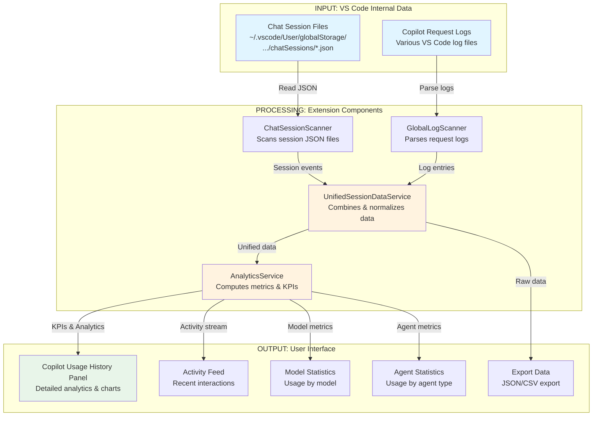
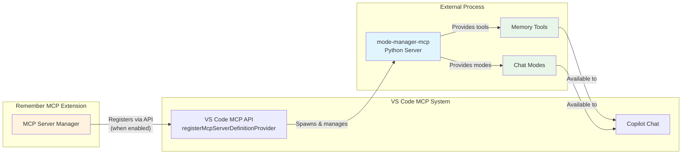

<!-- MARKETPLACE-EXCLUDE-START -->

<picture>
  <source media="(prefers-color-scheme: dark)" srcset="https://raw.githubusercontent.com/NiclasOlofsson/mode-manager-mcp/refs/heads/main/remember-new-logo-complete-white.svg">
  <source media="(prefers-color-scheme: light)" srcset="https://raw.githubusercontent.com/NiclasOlofsson/mode-manager-mcp/refs/heads/main/remember-new-logo-complete-black.svg">
  
</picture>

<!-- MARKETPLACE-EXCLUDE-END -->

# Remember MCP – GitHub Copilot Usage Analytics & Optional MCP Server Integration
<!-- MARKETPLACE-EXCLUDE-START -->

[](https://marketplace.visualstudio.com/items?itemName=nickeolofsson.remember-mcp-vscode)
[](https://github.com/tobiashochguertel/remember-mcp-vscode/actions/workflows/ci.yml)

<!-- MARKETPLACE-EXCLUDE-END -->

**Remember MCP** is a VS Code extension that **monitors and analyzes your GitHub Copilot usage** by scanning VS Code's internal chat session files and Copilot request logs. Get detailed insights into which AI models you're using, track premium requests, and understand your Copilot interaction patterns—all without requiring any external servers.

**Additionally**, this extension can optionally register the [Mode Manager MCP server](https://github.com/NiclasOlofsson/mode-manager-mcp) with VS Code's built-in MCP system, enabling advanced memory management and chat modes for Copilot.

## 🎯 What This Extension Actually Does

### Primary Feature: Copilot Usage Analytics (No External Dependencies)
The extension's **main purpose** is to provide comprehensive analytics about your GitHub Copilot usage by:
- **Scanning** VS Code's internal Copilot chat session JSON files (stored in `~/.vscode/User/globalStorage/`)
- **Monitoring** Copilot request logs across all VS Code instances on your machine
- **Analyzing** model usage patterns, response times, and file edit statistics
- **Visualizing** your Copilot activity through interactive dashboards in the sidebar

**This core functionality works completely standalone—no Python, no external servers, no additional setup required.**

### Secondary Feature: Optional MCP Server Registration
As an **optional feature**, you can enable MCP server registration to:
- Add persistent memory capabilities to Copilot (personal, workspace, language-specific)
- Use custom chat modes and power prompts
- Enhance Copilot with additional context management tools

This secondary feature requires Python and the mode-manager-mcp server, which the extension can help you set up.

## 📊 Architecture & Data Flow

### High-Level Architecture

```
┌─────────────────────────────────────────────────────────────────┐
│                    Remember MCP Extension                        │
│                                                                   │
│  ┌────────────────────┐          ┌──────────────────────────┐   │
│  │  Usage Analytics   │          │  MCP Server Manager      │   │
│  │  (Primary Feature) │          │  (Optional Feature)      │   │
│  └────────────────────┘          └──────────────────────────┘   │
└─────────────────────────────────────────────────────────────────┘
           │                                    │
           │                                    │
           ▼                                    ▼
┌──────────────────────┐          ┌──────────────────────────────┐
│  VS Code Internal    │          │  VS Code MCP API             │
│  Storage & Logs      │          │  (mcpServerDefinitionProvider)│
│                      │          │                              │
│  • Chat Sessions     │          │  Registers:                  │
│  • Request Logs      │          │  mode-manager-mcp server     │
│  • File Edits        │          │  (external process)          │
└──────────────────────┘          └──────────────────────────────┘
```

### Data Flow Diagram (Primary Feature: Usage Analytics)



### ASCII Data Flow (Alternative View)

```
INPUT                    PROCESSING                    OUTPUT
═══════                  ══════════                    ══════

Chat Session    ──┐
JSON Files        │
                  ├──► ChatSessionScanner ──┐
Request Log   ────┤                          │
Files             │                          ├──► UnifiedSessionData ──► AnalyticsService ──┬──► Usage History Panel
                  └──► GlobalLogScanner ─────┘         Service                              │
                                                                                             ├──► Activity Feed
                                                                                             │
File System                                                                                  ├──► Model Statistics
Watchers ────────────────────────────────────────────────────────────────────────────────►  │
(Real-time                                                                                   └──► Export Data (JSON/CSV)
 updates)
```

## 🔍 Understanding MCP (Model Context Protocol) Integration

### What is MCP?
The **Model Context Protocol (MCP)** is a standardized way for AI tools to access external context, tools, and resources. VS Code 1.102+ includes built-in MCP support, allowing extensions to register MCP servers that provide additional capabilities to Copilot.

### How This Extension Uses MCP (Optional Feature Only)

**Important:** The MCP server registration is an **optional secondary feature**. The extension's primary analytics functionality does NOT use MCP and works independently.



### Does This Extension Require an External MCP Server?

**No, not for the primary feature!** Here's the breakdown:

| Feature | Requires External MCP Server? | Dependencies |
|---------|------------------------------|-------------|
| **Copilot Usage Analytics** | ❌ No | None - uses VS Code's internal data |
| **Dashboard & Statistics** | ❌ No | None - all processing done in-extension |
| **Real-time Monitoring** | ❌ No | None - watches VS Code's file system |
| **Data Export** | ❌ No | None - pure TypeScript processing |
| **MCP Server Registration** | ✅ Yes (optional) | Python + mode-manager-mcp server |

### Communication with External MCP Server (When Enabled)

When you enable the optional MCP server feature:

1. **Registration Phase:**
   ```typescript
   // Extension registers server definition with VS Code
   vscode.lm.registerMcpServerDefinitionProvider('remember-mcp-provider', {
     provideMcpServerDefinitions: async () => {
       return [new vscode.McpStdioServerDefinition(
         'Remember MCP (Mode Manager)',
         command,  // e.g., 'pipx run mode-manager-mcp'
         args,
         {}, // environment variables
         '1.0.0'
       )];
     }
   });
   ```

2. **Lifecycle Management:**
   - VS Code automatically spawns the external MCP server process
   - VS Code manages stdin/stdout communication with the server
   - VS Code stops the server when no longer needed

3. **Communication Protocol:**
   - **Protocol:** JSON-RPC over stdio (standard input/output)
   - **Direction:** Bidirectional between VS Code and MCP server
   - **Extension's Role:** Only registers the server; does NOT communicate directly
   - **Copilot's Role:** Calls MCP tools/resources as needed during chat

## 🚀 Features & Benefits

### Primary Features (Always Available)
- **📈 Comprehensive Usage Analytics**: Track which models you use, how often, and when
- **💰 Cost Monitoring**: Understand your premium model usage to manage Copilot costs
- **⚡ Performance Metrics**: See response times, latency percentiles, and model performance
- **📝 Activity History**: Browse your complete Copilot interaction history
- **🎯 Agent Statistics**: Understand which Copilot agents you use most
- **📊 Model Breakdown**: See GPT-4, GPT-3.5, and other model usage patterns
- **💾 Data Export**: Export your usage data to JSON or CSV for external analysis
- **🔄 Real-time Updates**: Dashboard updates automatically as you use Copilot

### Secondary Features (Optional - When MCP Server Enabled)
- **🧠 Personal AI Memory**: Your preferences and reminders persist across sessions
- **👥 Workspace Memory**: Share team knowledge and conventions in your repository
- **🗣️ Language-Specific Memory**: Automatic context for Python, JavaScript, etc.
- **🎭 Custom Chat Modes**: Switch between different prompting modes for various tasks
- **📚 Power Prompts**: Pre-configured instruction sets for complex workflows

## 📦 Installation & Setup

### Quick Start (Analytics Only - Recommended)

1. **Install from VS Code Marketplace**
   
   [](https://marketplace.visualstudio.com/items?itemName=nickeolofsson.remember-mcp-vscode)

2. **That's it!** The extension will immediately start monitoring your Copilot usage.

3. **View Analytics:**
   - Click the Remember MCP icon in the Activity Bar (left sidebar)
   - Explore the "Copilot Usage History" panel

### Optional: Enable MCP Server Features

If you want the memory and chat mode features, follow these additional steps:

1. **Install Python 3.10+**
   ```bash
   # Check if you have Python
   python --version  # or python3 --version
   ```

2. **Install pipx** (if using default command)
   ```bash
   pip install pipx
   # or
   python -m pip install pipx
   ```

3. **Configure & Enable MCP Server**
   - Open VS Code Settings (`Ctrl/Cmd + ,`)
   - Search for "Remember MCP"
   - Ensure `remember-mcp.server.autoStart` is enabled
   - The extension will attempt to register the MCP server on startup

4. **Alternative: Custom Server Command**
   
   You can customize how the MCP server is launched:
   ```json
   {
     "remember-mcp.server.command": "uvx mode-manager-mcp",
     // or
     "remember-mcp.server.command": "docker run ... mode-manager-mcp",
     // or if installed globally
     "remember-mcp.server.command": "mode-manager-mcp"
   }
   ```

## 📖 Usage

### Viewing Usage Analytics

1. **Open the Remember MCP Sidebar**
   - Click the Remember MCP icon in the Activity Bar

2. **Explore the Panels:**
   - **Copilot Usage History**: Detailed analytics with KPIs, charts, and trends
   - **Copilot Usage**: Quick overview of current session statistics
   - **Server Control**: Manage the optional MCP server (if enabled)

3. **Key Metrics Explained:**
   - **Turns**: Number of back-and-forth exchanges with Copilot
   - **Sessions**: Distinct chat sessions you've had
   - **Requests**: Individual API requests to AI models
   - **Edits**: Times Copilot suggested file changes
   - **Edit Ratio**: Percentage of turns that resulted in file edits
   - **Latency**: Response time metrics (median, P95)

### Exporting Your Data

Click the **Export** button in the Usage History panel to save your data as:
- **JSON**: Complete raw data for programmatic analysis
- **CSV**: Spreadsheet-compatible format for Excel/Google Sheets

### Working with the MCP Server (Optional)

Once the MCP server is registered:

1. **Ask Copilot to Remember Something:**
   ```
   You: "Remember that I prefer detailed docstrings and use pytest for testing."
   Copilot: ✓ Stored in your personal memory
   ```

2. **Share Team Knowledge:**
   ```
   You: "Team: We use the Acme data pipeline template for all ETL jobs."
   Copilot: ✓ Stored in workspace memory
   ```

3. **Language-Specific Tips:**
   ```
   You: "For Python, always use type hints and Black formatting."
   Copilot: ✓ Stored in Python language memory
   ```

4. **Switch Chat Modes:**
   - Use `.chatmode.md` files to define custom prompting modes
   - Tell Copilot: "Switch to beast mode" or "Use architect mode"

<!-- MARKETPLACE-EXCLUDE-START -->

## ⚙️ Configuration

All settings are available in VS Code Settings (`Ctrl/Cmd + ,`) under "Remember MCP":

### Core Settings

| Setting | Default | Description |
|---------|---------|-------------|
| `remember-mcp.logLevel` | `info` | Log verbosity: `trace`, `debug`, `info`, `warn`, `error` |
| `remember-mcp.sessionAnalysis.enabled` | `false` | Enable background analysis of Copilot sessions |

### MCP Server Settings (Optional Feature)

| Setting | Default | Description |
|---------|---------|-------------|
| `remember-mcp.server.autoStart` | `true` | Auto-register MCP server on VS Code startup |
| `remember-mcp.server.command` | `pipx run ...` | Command to launch the MCP server |

## 🔧 Troubleshooting

### Analytics Not Showing Data?

1. **Use Copilot First**: The extension monitors your Copilot usage, so you need to use Copilot Chat to generate data
2. **Check Data Location**: Ensure VS Code's user data directory is accessible
3. **View Logs**: Open Output panel (`Ctrl/Cmd + Shift + U`) and select "Remember MCP"

### MCP Server Won't Register?

The MCP server feature is optional. If you only want analytics, you can disable it:
```json
{
  "remember-mcp.server.autoStart": false
}
```

If you want to enable MCP server features:

1. **Check Prerequisites:**
   ```bash
   python --version  # Should be 3.10+
   pipx --version    # Should be installed
   ```

2. **Test Server Manually:**
   ```bash
   pipx run --spec git+https://github.com/NiclasOlofsson/mode-manager-mcp.git mode-manager-mcp --help
   ```

3. **Check VS Code MCP Settings:**
   - Ensure `chat.mcp.enabled` is not set to `false` in VS Code settings

4. **Review Logs:**
   - Open "Remember MCP" output channel for detailed error messages

### Data Export Fails?

- Ensure you have write permissions to the selected directory
- Try exporting to a different location
- Check available disk space

## 🏗️ Development

### Building from Source

```bash
git clone https://github.com/tobiashochguertel/remember-mcp-vscode
cd remember-mcp-vscode
npm install
npm run compile
```

### Running in Development

1. Open the project in VS Code
2. Press `F5` to launch Extension Development Host
3. Test the extension in the new window

### Quality Checks

```bash
npm run lint        # Check code style
npm run typecheck   # Verify TypeScript types
npm run test        # Run test suite
npm run compile     # Build the extension
```

### Project Structure

```
remember-mcp-vscode/
├── src/
│   ├── extension.ts              # Main entry point
│   ├── scanning/                 # Data collection modules
│   │   ├── chat-session-scanner.ts    # Scans session JSON files
│   │   ├── global-log-scanner.ts      # Parses Copilot logs
│   │   └── ...
│   ├── services/                 # Business logic
│   │   ├── analytics-service.ts       # Computes metrics & KPIs
│   │   ├── unified-session-data-service.ts  # Data aggregation
│   │   └── ...
│   ├── webview/                  # UI components
│   │   ├── copilot-usage-history-panel/  # Main analytics dashboard
│   │   ├── copilot-usage-panel/          # Quick stats view
│   │   └── server-control-panel/         # MCP server controls
│   └── types/                    # TypeScript type definitions
└── ...
```

## 📚 Related Projects

- **[mode-manager-mcp](https://github.com/NiclasOlofsson/mode-manager-mcp)** – The external MCP server this extension can optionally register
- **[Model Context Protocol](https://modelcontextprotocol.io/)** – Learn about the MCP standard
- **[VS Code MCP API](https://code.visualstudio.com/api/references/vscode-api#lm)** – VS Code's MCP integration documentation

## 🤝 Contributing

Contributions are welcome! Please feel free to submit a Pull Request. See [EXTENSION_ANALYSIS.md](EXTENSION_ANALYSIS.md) for detailed technical analysis.

<!-- MARKETPLACE-EXCLUDE-END -->

## 📄 License

MIT License - see the [LICENSE](LICENSE) file for details.

## 🙏 Acknowledgments

This extension builds on VS Code's built-in MCP support and integrates with the mode-manager-mcp server for optional memory features. The analytics functionality is entirely self-contained and works independently.
